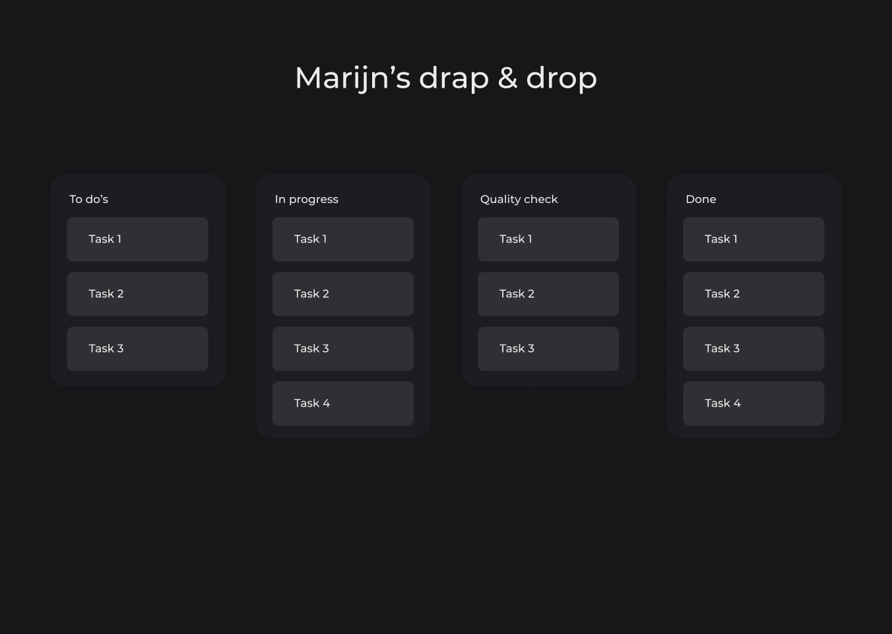
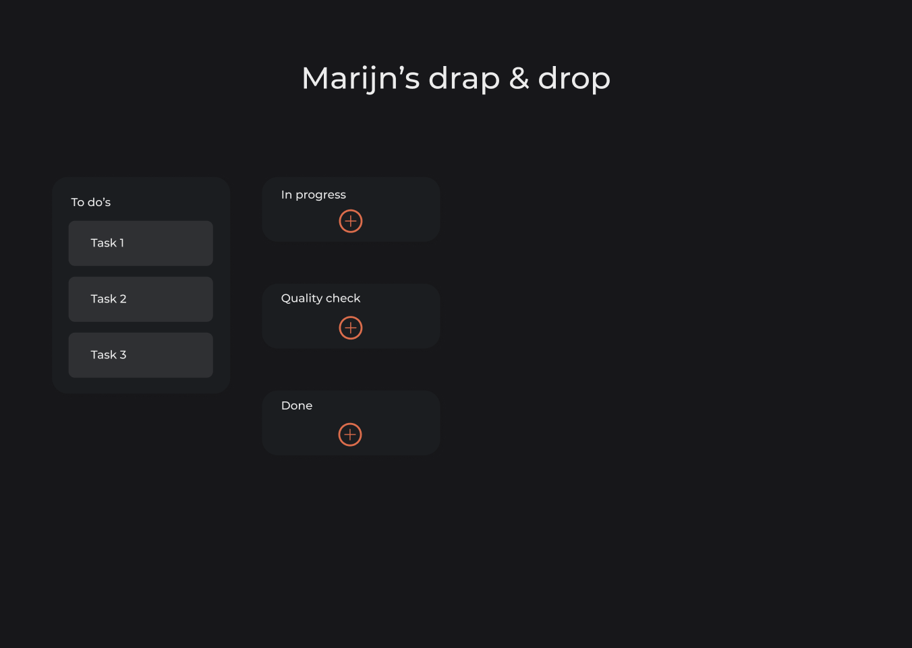
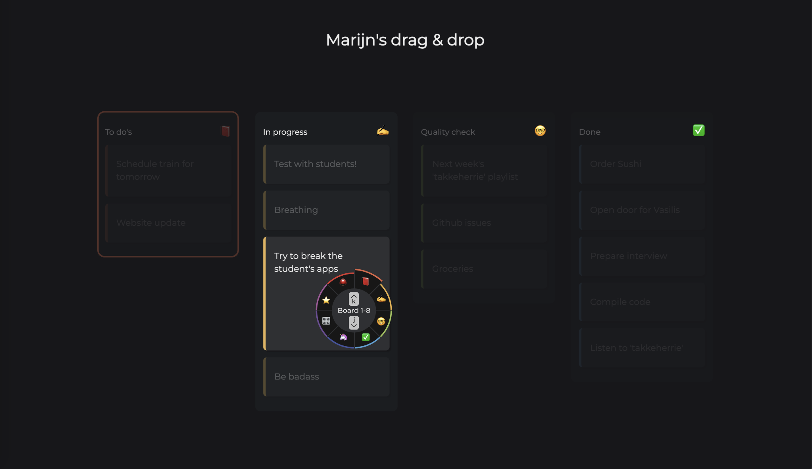
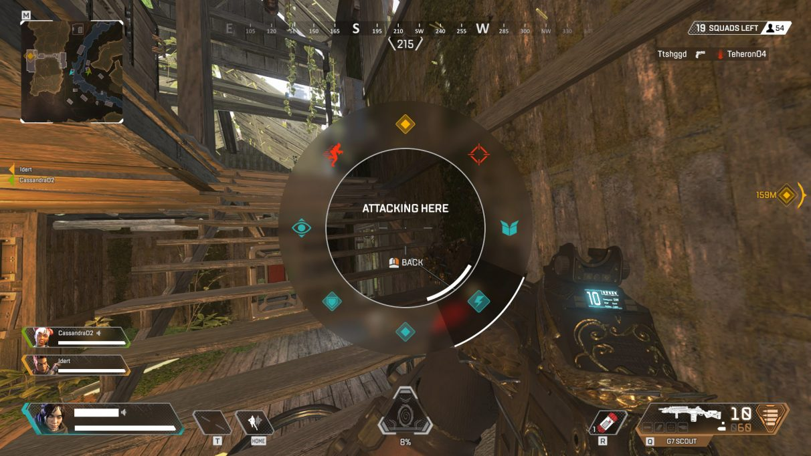

# Human Centered Design

## Marijn Meijles
Marijn is waarschijnlijk de beste developer die je ooit gaat ontmoeten. Een briljante nerd. Hij doet al jaren met heel veel plezier mee aan deze opdracht. Marijn heeft een motorische stoornis. Hij gebruikt zijn computer dus anders dan wij. Hij heeft veel moeite met fijne motoriek. Hij gebruikt zijn toetsenbord om te navigeren, en in de Accessibility settings van zijn Mac heeft hij Sticky Keys aan staan.

## Opdracht: Ontwerp een Drag & Drop lijst
Hoe kun je een drag & drop lijst optimaliseren voor een gebruiker die afhankelijk is van zijn toetsenbord én motorisch gestoord is?

live prototype [link!](https://jimmydekroon.github.io/human-centered-design-2021/)

# Week 1

## Test
Dit is de eerste keer dat we Marijn gaan ontmoeten en dus weten we nog niet zo veel over hem en hoe hij precies zijn computer gebruikt. We hebben dus een aantal aannames gedaan en als groep een klein drag & drop prototype gemaakt. Deze is uiteindelijk uitgebreid in meerdere variaties, op deze manier kunnen we beter zien hoe Marijn met verschillende oplossingen overweg kan. Zie de live versie van deze prototypes hier. [link!](https://sjorswijsman.github.io/human-centered-design-2021/week-1/index.html)

## Aantekeningen & feedback

- Gebruikt Vi editor en kent alle shortcuts erg goed.
    - https://www.guru99.com/the-vi-editor.html
- Gebruikt gewoon het toetsenbord en de trackpad.
- Dark mode is nice!
- Luistert naar takkeherrie
- Extreem goede/slimme developer
- Drag & drop gaat best goed, de versie met de “sticky” drag & drop was wel fijner.
- Tab gebruiken voor navigatie is niet ideaal, Marijn kan niet lekker terug (shift + tab is een lastige combinatie)
- Zoekt actief naar manieren om je app te slopen, zorgen dat je daar rekening mee houdt 😂
- Teveel tab gebruiken of andere toetsen achter elkaar indrukken is vervelend (hij heeft wel wat beters te doen). Proberen een interface te maken waar Marijn zo min mogelijk acties hoeft te doen.

## Volgende week
Ik weet nog niet goed welke kant ik op wil met mijn prototype, de tests van deze week waren al vrij experimenteel en er zijn veel verschillende vormen van drag & drop getest. Ik wil in ieder geval meer richting de trackpad qua functionaliteit aangezien Marijn hier minder moeite mee heeft dan veel toetsen gebruiken. Misschien een mix van trackpad met wat simpele toetscommands?

# Week 2

## Test
Marijn was deze week helaas niet beschikbaar voor een test dus is Vasilis voor hem ingevallen. Deze week heb ik een nieuwe richting voor mijn drag & drop idee gekozen. De kans dat Marijn een foutje maakt is groter als hij meer handelingen moet doen of langere handelingen moet doen. Ik wil er daarom graag voor zorgen dat Marijn zo min mogelijk afstand hoeft af te leggen (of zo min mogelijk handelingen hoeft te doen) om een taak van a naar b te verplaatsen op een trello achtig bord.

Om dit te doen ben ik begonnen aan een prototype dat het bord compacter maakt zodra Marijn een taak wil verplaatsen. Ik heb het prototype helaas niet compleet afgekregen voor deze week maar het was duidelijk genoeg om het concept door Vasilis te kunnen laten testen.

drag & drop main state
 
 

drag & drop compact state
 
 

## Feedback
De afstanden op het bord verkleinen kan zeker meerwaarde opleveren in de gebruikerservaring voor Marijn, maar er zijn meerdere manieren om het bord compacter of beter bereikbaar te maken. Even kijken naar andere manieren voor het compact maken van het bord.

En zorgen dat de hoofd functionaliteit in ieder geval werkt voor de volgende test (al is het gefaked). Dan kan er veel betere feedback gegeven worden.

## Volgende week
Het prototype verder uitwerken en afmaken zodat er volgende week echt goed getest kan worden. Ik ben geinspireerd door een idee van Vasilis en Giliam die een voorstel deden van een klein submenu, codepen voorbeeldje [hier!](https://codepen.io/perymimon/pen/ezslJ)

Het lijkt mij waardevol om een menu als deze te maken zodra er op een taak wordt geklikt, van hieruit kan Marijn dan kiezen in het submenu naar welk bord de taak moet. In principe lijkt dit idee erg op het idee van vorige week maar dit kan de afstand die Marijn moet afleggen nog kleiner maken.

# Week 3

## Test
De powerweek, deze week heb ik de app in grote lijnen af kunnen maken dus de test was erg waardevol. Marijn had deze week gelukkig weer tijd! Link naar het prototype [hier!](https://jimmydekroon.github.io/human-centered-design-2021/)

## feedback
De test was erg goed, Marijn vondt het vooral fijn dat hij minder hoeft te doen met zijn trackpad. De knoppen waren niet te klein en de kleuren die ik had gebruikt om hem te sturen waren duidelijk.

- Het cancellen van een selectie kan momenteel alleen door op dezelfde of op een van de andere kaarten te klikken. Als Marijn buiten de boards klikt, op de zwarte achtergrond bijvoorbeeld, gebeurt er niets en lijkt het alsof hij vastzit in deze "move" modus.

- Marijn is wel benieuwd hoe dit zou werken met een groter trelloboard. Marijn heeft zelf een trelloboard met ~20 borden, dit past natuurlijk niet meer in dat kleine submenu. Hoe zou ik dit oplossen?

- Kan dit uitgebreid worden met keyboard shortcuts (bijvoorbeeld die van VI, want die kent Marijn al). Er kan bijvoorbeeld een move modus en een insert modus komen. zodat merijn op verschillende manieren met board kan interacteren.

## volgende week
Volgende week is de oplevering, dat betekent dat deze week helaas de laatste week was om te testen met Marijn. Gelukkig heb ik waardevolle feddback gehad deze week.

Er is weinig tijd tussen nu en de beoordeling dus ik denk dat deze functionaliteiten te groot zijn om in 1 week te bouwen. Ik wil daarom in ieder geval een ontwerp maken voor het submenu als er veel meer boards zijn (zoals Marijn heeft).

# Week 4

Dit ontwerp heb ik gemaakt als oplossing voor een trello board met veel kolommen. In het submenu van vorige week kan ik niet veel verschillende kolommen kwijt, met dit ontwerp kan dat wel.

Door een ronde selector te gebruiken kan Marijn een kolom uitkiezen waar deze taak heen moet. Deze cirkel kan 8 kolommen laten zien, maar met dit menu kan ook gescrolled worden. Als je naar de beneden of naarboven scrolled (of j/k gebruikt) worden de volgende 8 kolommen weergegeven. Zo kunnen er makkelijk een grote hoeveelheid items in het menu staan.

Inspiratie voor dit idee kwam van een aantal videogames die acties/emotes met een "wiel" menu weergeven.

 
 

Hier een voorbeeld van de game Apex Legends:
